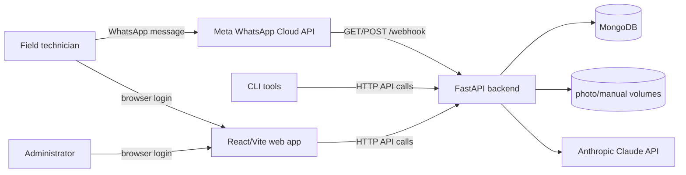

# West End Glass Maintenance System

West End Glass Maintenance System is a Docker-based field-maintenance application for managing machines, technicians, tickets, daily checklists, uploaded manuals/photos, and technician conversations.

The repository contains:

- `backend_api/` — FastAPI backend for admin/technician authentication, ticket workflows, machine/user management, WhatsApp webhooks, simulation endpoints, manuals, photos, daily checklists, dashboard stats, and audit logs.
- `backend_admin_page/` — React + Vite web app for the admin dashboard and technician-facing screens.
- `tools/` — command-line utilities for seeding/resetting data, importing checklist templates, administering the system, and simulating WhatsApp conversations.
- `Documentation/` — supporting architecture notes, Meta WhatsApp API material, and checklist import examples.
- `deploy/` — production-oriented Docker Compose configuration.

## Prerequisites

- Docker and Docker Compose.
- Python 3.8+ if you want to run the tools directly.
- Node.js/npm if you want to run the frontend outside Docker.
- Backend environment variables in `backend_api/.env`. Start from `backend_api/.env.example` and replace placeholder values with real credentials.

## Quick start with Docker Compose

1. Create the backend environment file:

   ```bash
   cp backend_api/.env.example backend_api/.env
   ```

2. Edit `backend_api/.env` and set the required Meta, Anthropic, JWT, and admin values.

3. Start the stack:

   ```bash
   docker compose up -d
   ```

4. Open the local services:

   - Admin/technician web app: http://localhost:3030
   - Backend API health check: http://localhost:8835/health
   - Backend OpenAPI docs: http://localhost:8835/docs

5. Check container status and logs:

   ```bash
   docker compose ps
   docker compose logs -f fastapi-app
   ```

The Docker Compose file maps the backend container's port `8000` to host port `8835`, and maps the frontend container to host port `3030`.

## Local development

### Backend API

```bash
cd backend_api
python -m venv .venv
source .venv/bin/activate
pip install -r requirements.txt
uvicorn app.main:app --reload
```

When run directly with Uvicorn, the API normally serves at http://localhost:8000.

### Frontend

```bash
cd backend_admin_page
npm install
npm run dev
```

The Vite development server normally serves at http://localhost:5173. Set `VITE_API_BASE_URL` if your backend is not at the frontend's default API URL.

### Tools

Install tool dependencies:

```bash
pip install -r tools/requirements.txt
```

Run the WhatsApp simulator against the backend:

```bash
python tools/simulate_whatsapp_chat.py --api-url http://localhost:8835
```

Run the admin CLI:

```bash
python tools/admin_cli.py login --api-url http://localhost:8835
python tools/admin_cli.py tickets list --api-url http://localhost:8835
```

## Architecture



Source-backed components for this diagram:

- `docker-compose.yml` defines `mongo`, `fastapi-app`, and `admin-frontend` services plus `photo_data` and `manual_data` volumes.
- `backend_api/app/main.py` registers the FastAPI routers and `/health` endpoint.
- `backend_api/app/routers/webhook.py` exposes the Meta webhook routes.
- `backend_api/app/services/claude_agent.py` and `backend_api/app/services/message_processor.py` handle AI-assisted message processing.
- `backend_admin_page/src/api/client.js` defines the frontend API client.
- `tools/admin_cli.py` and `tools/simulate_whatsapp_chat.py` call the backend over HTTP.

## Main backend surfaces

The backend registers these route groups in `backend_api/app/main.py` and `backend_api/app/routers/`:

- `/auth` — admin login and current-user lookup.
- `/auth/technician/login` — technician login.
- `/admins` — admin account management.
- `/users` — technician user management.
- `/machines` — machine registry.
- `/tickets` — ticket CRUD, messages, photos, close/reopen, and reference photos.
- `/tech` — technician ticket workflow endpoints.
- `/ticket-types` — ticket type management.
- `/dailys` — daily checklist templates and triggers.
- `/manuals` — manual upload/download endpoints.
- `/dashboard` — dashboard statistics.
- `/audit` — audit log access.
- `/simulate` — WhatsApp simulation endpoints.
- `/webhook` — Meta WhatsApp webhook verification and inbound message handling.
- `/settings/public` and `/health` — public settings and health check.

For the complete interactive API reference, run the backend and open `/docs`.

## Testing

Backend tests live in `backend_api/tests/` and use pytest:

```bash
cd backend_api
pytest
```

Frontend scripts are defined in `backend_admin_page/package.json`:

```bash
cd backend_admin_page
npm run lint
npm run build
```

Real WhatsApp tests under `test/` can send live messages if configured with Meta credentials. Treat those as side-effecting tests and use test numbers only.

## Documentation map

- `QUICKSTART.md` — fastest Docker-based setup path.
- `TESTING.md` — development and testing workflows.
- `backend_api/README.md` — backend setup, endpoints, and debugging.
- `backend_admin_page/README.md` — frontend setup, pages, and development notes.
- `tools/README.md` — simulator and admin CLI usage.
- `Documentation/whatsapp_waba_webhook_filtering.md` — WhatsApp webhook filtering notes.
- `Documentation/JoesTechTake.md` — additional implementation notes.

## Security and secrets

Do not commit `backend_api/.env`, saved admin CLI tokens, real Meta/Anthropic credentials, private keys, or production customer data. The admin CLI stores its token in `~/.west_end_glass_token` by default.
